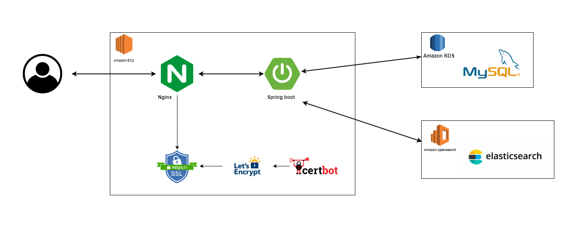

# hoon-log
벨로그를 모티브로한 블로그 플랫폼입니다

## 배포주소
URL: https://hoon-log.p-e.kr

## 작업기간
- 2023.09 ~ 

## 분석과 기획
- [요구사항](https://aware-perfume-e8c.notion.site/d9124c6554ed4684ba5230c0f8f7539d?pvs=4)
- [도메인설계](https://aware-perfume-e8c.notion.site/d9124c6554ed4684ba5230c0f8f7539d?pvs=4)

## API 명세서

- [API 명세서](https://documenter.getpostman.com/view/28969068/2s9YXk214n)

## 아키텍처



## 기능 내용

- 회원가입
- 로그인
- 로그아웃
- 회원정보 조회
- 회원정보 수정
- 게시글 CRUD
- 태그 CRUD
- 댓글 CRUD
- 게시글 최신순 조회
- 게시글 트렌드 조회
- 게시글 태그별 조회
- 상품 좋아요 요청 / 취소 요청

## 기술 스택

- java
- spring boot
- gradle
- jpa
- spring security
- mysql
- elasticsearch
- docker

## 실행방법

1. `git clone https://github.com/honki12345/hoon-log.git`
2. 환경변수를 설정해줍니다  
  ```
LOCAL_DB_URL: 
LOCAL_DB_USERNAME: 
LOCAL_DB_PASSWORD: 
JWT_SECRET_KEY: 
JWT_REFRESH_KEY:
  ```
3. mysql을 켜줍니다
4. docker-compose 를 통해 elasticsearch 를 켜줍니다  
`docker-compose -f es.yml up -d`
5. 스프링부트를 켜줍니다  
  `./gradlew clean build`  
  `java -jar "-Dspring.profiles.active=dev" ./build/libs/hoon-log-0.0.1-SNAPSHOT.jar`